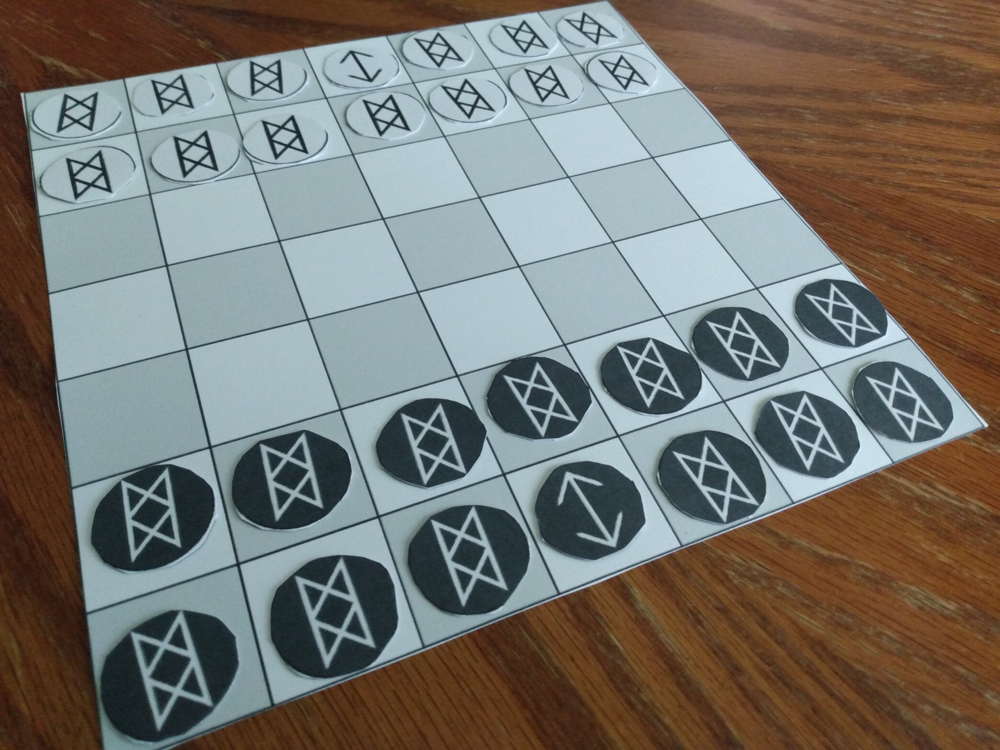

# Oferhlýp
Development has been moved to **[Codeberg](https://codeberg.org/jaerrib/oferhlyp)**.

## Overview
**Oferhlýp** is a free libre open source abstract strategy game played between two players on 7x7 grid. On the surface, gameplay is similar to checkers (draughts). However, there are several differences:

- Tokens may move in any direction rather than just forwards diagonally.
- A player’s own pieces may be jumped to create a more dynamic game.
- Tokens must be jumped twice before they are removed from the board.
- Each player has a "king" token that must be captured to end the  game.

## History
**Oferhlýp** was conceived in 2013 while I was working on another game. _Claim the Crown_ incorporated the concept of tokens with two hit points but featured various types of Middle Ages themed units like spearmen and archers and replaced jump attacks with dice rolling combat. **Oferhlýp** is a purer abstract interpretation of that with a focus on strategy over luck.

The first iteration of **Oferhlýp** was fun to play and had good early and middle play development, but the endgame stalled and produced a lot of stalemate situations. Beginning with the version 2 fork, the board has been revised to a standard grid (_a la_ certain Hnefetafl variants) and kings have been introduced.

## Project goals
My goal with **Oferhlýp** is to build an engaging abstract strategy experience that is simple to learn while offering a level of complexity in mastering it. I opted to do this under an open source license because I am inspired by Linux and similar software and would like the game to be free (as in freedom as well as in beer) to all. I chose CC BY-SA because it's the most comparable to the the GPL.

---

Shield: [![CC BY-SA 4.0][cc-by-sa-shield]][cc-by-sa]

This work is licensed under a
[Creative Commons Attribution-ShareAlike 4.0 International License][cc-by-sa].

[![CC BY-SA 4.0][cc-by-sa-image]][cc-by-sa]

[cc-by-sa]: http://creativecommons.org/licenses/by-sa/4.0/
[cc-by-sa-image]: https://licensebuttons.net/l/by-sa/4.0/88x31.png
[cc-by-sa-shield]: https://img.shields.io/badge/License-CC%20BY--SA%204.0-lightgrey.svg