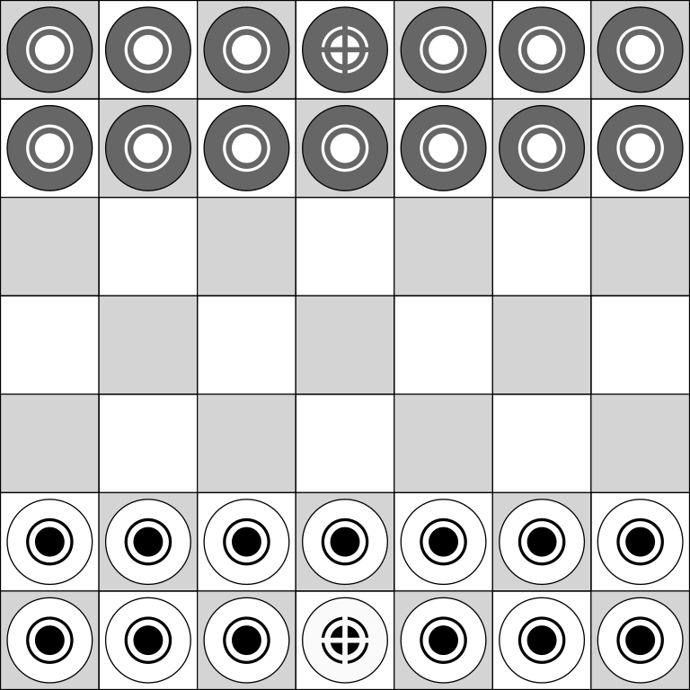

% Oferhlýp
% by John Beers
% Version 2.0

## Overview
**Oferhlýp** is a free libre open source abstract strategy game played between two players on 7x7 grid. On the surface, gameplay is similar to checkers (draughts). However, there are several differences:

- Tokens may move in any direction rather than just forwards diagonally.
- A player’s own pieces may be jumped to create a more dynamic game.
- Tokens must be jumped twice before they are removed from the board
- Each player has a king token that must be captured to end the  game.

## Objective
Players try to eliminate their opponent’s king via jumping attacks while protecting their own king.

## Components
- Game board
- 14 two-sided light tokens (1 king and 13 standard)
- 14 two-sided dark tokens (1 king and 13 standard)

*Note: kings are denoted by a different symbol design in comparison to the standard tokens.*

### Example tokens
 Dark (full)   Dark king (full)  
 Light (half)   Light king (half)

## Setup & starting the game
Players place their tokens on the squares comprising the two rows closest to them with the king occupying the middle square of the edge row. Placement is closer to chess rather than checkers as all squares are utilized regardless of color. 

All tokens start at *full-strength* status with the double bulls-eye side up.

Players choose which color (light or dark) to use with the dark color taking the first turn. Players then alternate taking turns.

## Playing the game
On a player’s turn, the player may *move* or *attack* with one token. 

### Moving
Tokens may be moved one square in any direction onto an open square.
A token belonging to the player may be jumped in a legal move called a *friendly jump*. Making more than one friendly jump per turn is not permitted.

A player may not follow a move or friendly jump by an attack. A player may not follow an attack and with a move or friendly jump.

### Attacking
Players may *attack* an opponent’s token by jumping directly over it to an open square. Attacks are not compulsory.

Players may perform a *chain attack* by jumping more than one of their opponent’s tokens in a sequence (similar to checkers) following the normal attack rule.

After being attacked, tokens at *full-strength* status are flipped over to the open bulls-eye side to signify that they are now at *half-strength*.

Tokens at *half-strength* status are removed from the board after being attacked a second time and are out of play.

Tokens may not be attacked more than once per turn, even as part of a chain attack. Players also cannot simply jump over a token then jump back over the same token.

## Winning the game
Players continue to alternate turns until one of the kings has been eliminated.

A *stalemate* occurs if the two kings are the last pieces on the board as neither player could move without placing their own king into a position which would be vulnerable to an *attack*.

Perpetual repetition is illegal. If a board position is repeated three times, the player in control of the situation must find another move.

## Credits
**Oferhlýp** was created by John Beers. It was conceived in 2013 while working on another game. **Claim the Crown** incorporated the concept of tokens with two hit points but featured various types of Middle Ages themed units like spearmen and archers and replaced jump attacks with dice rolling combat. Oferhlýp is a purer abstract interpretation of that with a focus on strategy over luck.

## Legal
**Oferhlýp** is available under a Creative Commons Attribution-ShareAlike 4.0 International license. (https://creativecommons.org/licenses/by-sa/4.0/)

**You are free to:**

- **Share** - copy and redistribute the material in any medium or format

- **Adapt** - remix, transform, and build upon the material for any purpose, even commercially.

The licensor cannot revoke these freedoms as long as you follow the license terms.

**Under the following terms:**

- Attribution - You must give appropriate credit, provide a link to the license, and indicate if changes were made. You may do so in any reasonable manner, but not in any way that suggests the licensor endorses you or your use.
- ShareAlike - If you remix, transform, or build upon the material, you must distribute your contributions under the same license as the original.

**No additional restrictions** — You may not apply legal terms or technological measures that legally restrict others from doing anything the license permits.

## Find out more

More information on **Oferhlýp** and “living rules” can be found at:
http://github.com/jaerrib/oferhlyp